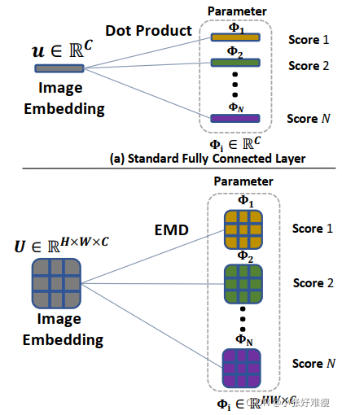
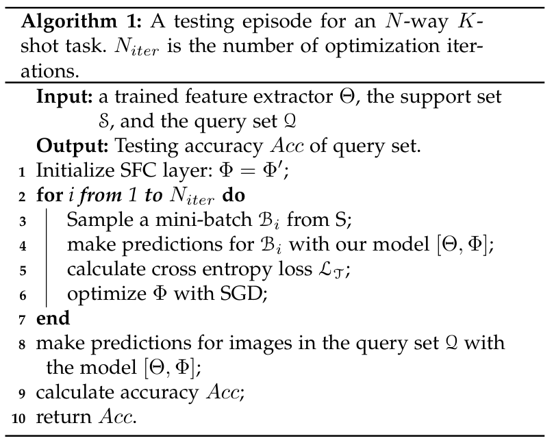
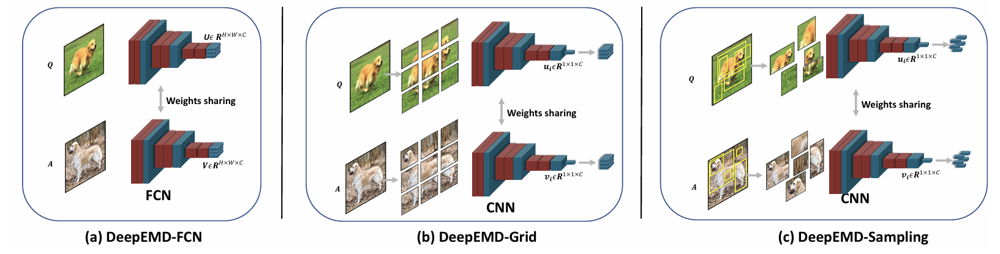
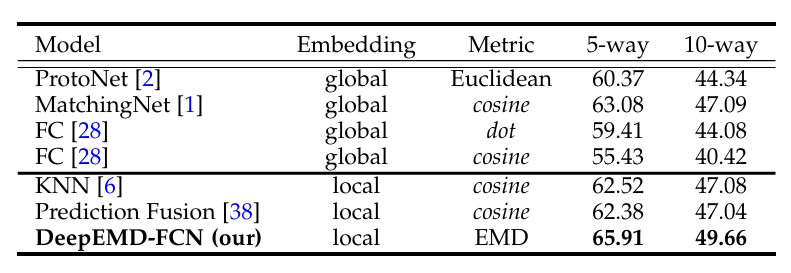
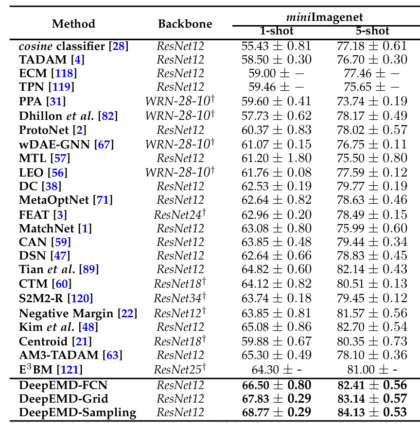
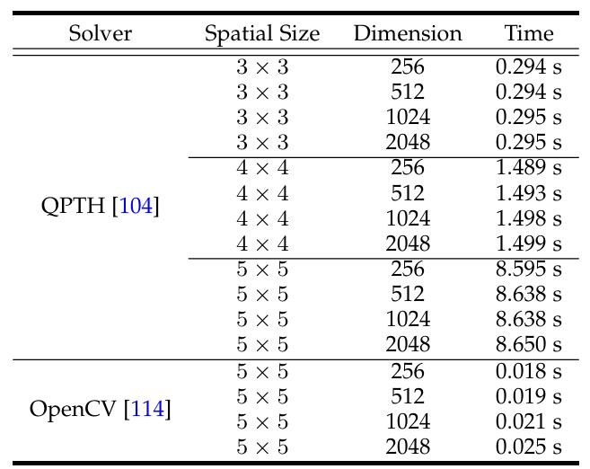

# 小样本学习实验报告

221900067 袁宇枫

## 一、实验概述

在[LibFewShot](https://github.com/RL-VIG/LibFewShot)框架上实现⼀种尚未在该库中集成的⼩样本算法，该算法需要为已发表的顶会论⽂，复现精度误差为~2%以内。

本次选择对[DeepEMD: Differentiable Earth Mover&#39;s Distance for Few-Shot Learning](https://ieeexplore.ieee.org/abstract/document/9930675/)这篇论文论文中的DeepEMD算法进行复现。

## 二、实验环境

- 硬件环境：
  + CPU：15 vCPU AMD EPYC 7543 32-Core Processor
  + NVIDIA A40(48GB)
  + 内存：80GB
- 软件环境：
  + 操作系统：Ubuntu 20.04.3 LTS
  + Python版本：3.8.10
  + PyTorch版本：2.0
  + CUDA版本：11.8
  + opencv-python版本：4.7.0
  + qp-th版本：0.0.17
  + 其余依赖库详见requirements.txt

## 三、论文理解

本篇论文将小样本分类形式化为最优匹配的一个实例，并提出用两个结构之间的最优匹配代价来表示它们的相似性。给定由两幅图像生成的特征表示，我们采用Earth Mover’s Distance（EMD）来计算它们的结构相似性。EMD是计算结构表示之间距离的度量，最初是为图像检索而提出的。在给定单元对间距的情况下，EMD可以获得代价最小的两种结构之间的最优匹配流。它也可以解释为用另一个结构表示法重建结构表示法的最小成本。

### 3.1 Earth Mover’s Distance（EMD）

Earth Mover’s Distance是两组加权对象或分布之间的距离度量，它建立在单个目标之间的基本距离之上。它的形式是经过充分研究的线性规划运输问题（TP）。假设需要一组来源或供应商$S=\{ s_i| i = 1,2,3 \cdots ,m\}$将货物运输到一组目的地或需求方$D=\{ d_j| j = 1,2,3 \cdots ,k\}$，其中$s_i$表示第i个供应商能够供应的单位，$d_j$表示第j个需求方所需求的单位。每个供应商和需求方之间的运输成本是$c_{ij}$，表示从$s_i$到$d_j$的单位运输成本, $x_{ij}$表示从$s_i$到$d_j$的运输量。线性规划运输问题（TP）的目标是找到一种最佳的运输方案，使得总运输成本最小$\widetilde{X}=\{x_{ij}|i=1,2,3 \cdots ,m,j=1,2,3 \cdots ,k\}$，最终得到的$\widetilde{X}$是一个m×k的矩阵。

$$
\begin{aligned}
\text{minimize: } & \sum_{i=1}^{m}\sum_{j=1}^{k}c_{ij}x_{ij}\\
\text{subject to: } & x_{ij} \geq 0, \quad i = 1,2,3, \cdots ,m, j = 1,2,3, \cdots ,k \\
& \sum_{j=1}^{k}x_{ij} = s_i, \quad i = 1,2,3, \cdots ,m \\
& \sum_{i=1}^{m}x_{ij} = d_j, \quad j = 1,2,3, \cdots ,k \\
\end{aligned}
$$

### 3.2 适用于小样本分类的EMD

在小样本分类任务中，基于度量的方法旨在找到一个良好的距离度量和数据表示来计算用于分类的图像之间的相似性。与以往的图像级嵌入之间进行距离计算的方法不同，DeepEMD中的方法提倡使用有区别的局部信息。将一幅图像分解为一组局部表示，并使用两幅图像之间的最佳匹配代价来表示它们的相似性。具体地说，首先部署一个全卷积网络（FCN）来生成图像嵌入$U \in RH \times W \times C$，其中H和W表示特征图的空间大小，C表示特征尺寸。每个图像表示都包含一组局部特征向量$[u_1;u_2;\cdots u_{HW}]$，每个向量$u_i$都可以看作集合中的一个节点。因此，两幅图像的相似性可以表示为两组向量之间的最佳匹配代价。根据方程1中的原始EMD公式，通过从两个图像特征计算嵌入节点$u_i、v_j$之间的成对距离来获得单位成本：

$$
c_{ij} = 1-\frac{u_i^Tv_j}{||u_i||_2||v_j||_2}
$$

其中，具有相似表示的节点倾向于在彼此之间生成较少的匹配成本。关于权重$s_i$和$d_j$的生成，将在第3.4节中进行详细阐述。一旦获得最佳匹配流$\widetilde{X}$，就可以使用以下公式计算图像表示之间的相似性分数s：

$$
s(U,V) = \sum_{i=1}^{HW}\sum_{j=1}^{HW}(1-c_{ij})\widetilde{x}_{ij}
$$

### 3.3 端到端训练

为了将最优匹配问题映射到神经网络中进行端到端训练，使最优匹配$\widetilde{X}$的解相对于问题参数$\theta$可微是有帮助的。我们可以在最优性（KKT）条件下应用隐函数定理来获得 Jacobian矩阵。首先，我们将EMD问题转化为线性规划问题，然后将其转化为标准形式。在标准形式下，线性规划问题可以表示为：

$$
\begin{aligned}
\text{minimize: } & c(\theta)^{T}x\\
\text{subject to: } & G(\theta)x \leqslant h(\theta)\\
& A(\theta)x = b(\theta)\\
\end{aligned}
$$

其中，$x \in R^n$是我们的优化变量，$n=HW \times HW$表示X中匹配流的总数。$\theta$是与早期层相关的问题参数。$Ax=b$表示等式约束和$Gx \leq h$表示不等式约束。因此，该LP问题的拉格朗日公式如下所示：

$$
L(\theta,x,\lambda,\nu) = c^{T}x + \lambda^{T}(Gx-h) + \nu^{T}(Ax-b)
$$

式中，ν是等式约束和$\lambda$上的对偶变量$\geqslant 0$是不等式约束上的对偶变量。

在KKT条件下，利用原始-对偶内点法求解$g(\theta,\widetilde{x},\widetilde{\lambda},\widetilde{\nu})$，得到目标函数的最优$(\widetilde{x},\widetilde{\lambda},\widetilde{\nu})$，其中：

$$
g(\theta,x,\lambda,\nu) = \begin{bmatrix} \nabla_{\theta}L(\theta,x,\lambda,\nu) \\ diag(\lambda)Gx-h \\ A(\theta)x - b(\theta) \end{bmatrix} = 0
$$

假设$g(\theta,\widetilde{x},\widetilde{\lambda},\widetilde{\nu})=0$。然后，当所有导数都存在时，可通过满足以下条件获得最优解$(\widetilde{x},\widetilde{\lambda},\widetilde{\nu})$处x相对于$\theta$的部分Jacobian矩阵，即$J_{\theta}\widetilde{x}$:

$$
J_{\theta}\widetilde{x}= -J_{x}(\theta,\widetilde{x},\widetilde{\lambda},\widetilde{\nu})^{-1}J_{\theta}g(\theta,\widetilde{x},\widetilde{\lambda},\widetilde{\nu})
$$

将隐函数定理应用于KKT条件，得到了解映射的雅可比矩阵公式。例如，关于θ的（部分）Jacobian矩阵可以定义为

$$
J_{\theta}\widetilde{x} = \begin{bmatrix} J_{\theta}\nabla_{x}L(\theta,\widetilde{x},\widetilde{\lambda},\widetilde{\nu}) \\ diag(\widetilde{\lambda})J_{\theta}(G(\theta)x - h(\theta)) \\ J_{\theta}(A(\theta)x - b(\theta)) \end{bmatrix}
$$

因此，一旦得到LP问题的最优解$\widetilde{x}$，就可以得到$\widetilde{x}$相对于输入LP参数$\theta$的梯度的一个闭式表达式。这有助于我们在整个优化过程中实现高效的反向传播，而不会扰动初始化和优化轨迹。

### 3.4 权重生成

从EMD公式中可以观察到，一个重要的问题参数是每个节点的权重，例如$s_i$，它控制来自它的总匹配流$\sum_{j=1}^{n}x_{ij}$。直观地说，权重较大的节点在两个集合的比较中起着更重要的作用，而一个节点
如果权重很小，则无论与哪个节点匹配，都很难影响总体距离。在采用EMD进行基于颜色的图像检索的开创性工作中，他们使用直方图作为基本特征，并对所有像素执行特征聚类以生成节点。每个节点的权重设置为相应集群的大小。这是有意义的，因为对于基于颜色的图像检索，应该为具有更多像素的主颜色赋予较大的权重，以便检索的图像可以在视觉上接近查询图像。

然而，对于小样本图像分类任务，其中用于分类的特征通常具有高级语义，像素的数量不一定反映重要性。在分类数据集中，通常会发现背景区域大于目标对象的图像数据，例如ImageNet。因此，仅通过检查单个图像很难确定局部特征表示的重要性。相反，作者认为对于小样本分类任务，应该通过比较两侧的节点来生成节点特征的权重。为了实现这一目标，提出了一种交叉参考机制，该机制使用另一个结构中的节点特征和平均节点特征之间的点积来生成相关性得分作为权重值：

$$
s_i = max\{\frac{u_{i}^T \sum_{j=1}^{HW}v_j}{HW},0\}
$$

其中$u_i$和$v_j$表示来自两个特征映射的向量，函数max（·）确保权重始终为非负。为了清楚起见，这里我们仅以$s_i$为例，并且可以以相同的方式获得$d_i$。交叉参考机制的目的是在两幅图像中对高方差背景区域赋予较少的权重，而对共现目标区域赋予更多的权重。这还可以减少两幅图像中未出现的目标部分的权重，从而在一定程度上允许部分匹配。最后，我们对结构中的所有权重进行归一化，以使两侧具有相同的总权重进行匹配。

### 3.5 构建全卷积网络（FCN）

到目前为止，我们已经讨论了使用Earth Mover’s Distance 作为度量来生成成对图像之间的距离值。然后提出了一个问题，在多个支持图像可用的情况下，我们如何处理k-shot设置？在详细介绍论文的设计之前，了解一下标准的全层分类是如何对CNN提取的图像嵌入进行分类的。由$[\varPhi_1,\varPhi_2,\cdots \varPhi_N] \in \mathbb{R}^{C \times N}$参数化的FC层包含一组可学习向量$\varPhi_i \in 对应于每个类别的RC$，在推理时，给定一个嵌入图像$u \in 由卷积层生成的RC$，FC层通过计算图像向量u和参数向量$\varPhi_i$之间的点积生成i类分数，该过程通过矩阵乘法并行应用于所有类别。还有一些以前的工作将FC层中的点积运算替换为计算类别分数的余弦函数。FC层的学习可以看作是为每个类找到一个原型向量，这样我们就可以使用距离度量对图像进行分类。标准FC层的图示如图中（a）所示。

使用相同的公式，我们可以学习一个结构化的完全连通层，该层采用EMD作为距离函数，直接对结构化特征表示进行分类。每个类的可学习嵌入成为一组向量，而不是一个向量，因此我们可以使用结构化距离函数EMD进行图像分类。这也可以解释为学习由每个类的虚拟图像生成的原型特征图。结构化FC和标准FC的比较如下图所示。在推理时，我们将训练好的1-shot FCN模型作为特征提取器，并使用SGD从支持集采样数据来学习结构化全连通层中的参数。



伪代码形式如下：



### 3.6 DeepEMD-FCN, DeepEMD-Grid, DeepEMD-Sampling



对于DeepEMD-FCN，为了提高模型的准确率，引入了特征金字塔（Feature Pyramid）结构，以便在不同尺度上提取特征。

而对于DeepEMD-Grid和DeepEMD-Sampling，如上图可以看出，通过对采样器获得的图片进行切割，可以得到更多的样本，从而提高模型的准确率。

## 四、代码复现

+ 注释：在本报告中代码注释均使用中文，以便更好地理解代码。而在LibFewShot框架中，代码注释使用英文，与框架内其他代码风格保持一致。

### 4.1 数据集准备

本次实验使用[miniImageNet](https://github.com/RL-VIG/LibFewShot#datasets)数据集。下载完成后，将数据集解压到 `/data`目录下。

### 4.2 Backbone网络

论文中使用的是ResNet-12作为Backbone网络，但是 `/LibFewShot/core/model/backbone/resnet_12.py`中集成的ResNet-12与论文中的ResNet-12有所不同，因此需要自行实现ResNet-12网络。

```python
class ResNet(nn.Module):
    def __init__(self,block=BasicBlock, keep_prob=1.0, avg_pool=False, drop_rate=0.0, dropblock_size=5,**kwargs):
        self.inplanes = 3
        super(ResNet, self).__init__()

        self.layer1 = self._make_layer(block, 64, stride=2, drop_rate=drop_rate)
        self.layer2 = self._make_layer(block, 160, stride=2, drop_rate=drop_rate)
        self.layer3 = self._make_layer(block, 320, stride=2, drop_rate=drop_rate, drop_block=True,
                                       block_size=dropblock_size)
        self.layer4 = self._make_layer(block, 640, stride=2, drop_rate=drop_rate, drop_block=True,
                                       block_size=dropblock_size)
        if avg_pool:
            self.avgpool = nn.AvgPool2d(5, stride=1)
        self.keep_prob = keep_prob
        self.keep_avg_pool = avg_pool
        self.dropout = nn.Dropout(p=1 - self.keep_prob, inplace=False)
        self.drop_rate = drop_rate

        for m in self.modules():
            if isinstance(m, nn.Conv2d):
                nn.init.kaiming_normal_(m.weight, mode='fan_out', nonlinearity='leaky_relu')
            elif isinstance(m, nn.BatchNorm2d):
                nn.init.constant_(m.weight, 1)
                nn.init.constant_(m.bias, 0)

    def _make_layer(self, block, planes, stride=1, drop_rate=0.0, drop_block=False, block_size=1):
        downsample = None
        if stride != 1 or self.inplanes != planes * block.expansion:
            downsample = nn.Sequential(
                nn.Conv2d(self.inplanes, planes * block.expansion,
                          kernel_size=1, stride=1, bias=False),
                nn.BatchNorm2d(planes * block.expansion),
            )

        layers = []
        layers.append(block(self.inplanes, planes, stride, downsample, drop_rate, drop_block, block_size))
        self.inplanes = planes * block.expansion

        return nn.Sequential(*layers)

    def forward(self, x):
        x = self.layer1(x)
        x = self.layer2(x)
        x = self.layer3(x)
        x = self.layer4(x)
        return x
```

### 4.3 DeepEMD模型

#### 4.3.1 EMDLayer（实现EMD算法）

1. 权重向量

   由于EMD算法需要计算两个特征图之间的权重向量，因此需要实现一个函数，根据输入的两个特征图A和B，计算两个特征图各节点之间权重，返回权重向量。

   同时，由于不能确定支持集和查询集哪一个是供应商A，哪一个是需求方B，因此需要计算两个权重向量，分别为$weight_1$和$weight_2$。

   ```python
   def get_weight_vector(self, A, B):
   	# 获取A，B第一个维度的大小
   	M = A.shape[0] 
   	N = B.shape[0]
   	# 对B的特征图进行平均池化，并复制到A的大小
   	B = F.adaptive_avg_pool2d(B, [1, 1])
   	B = B.repeat(1, 1, A.shape[2], A.shape[3])
   	# 对A，B的特征图进行升维
   	A = A.unsqueeze(1)
   	B = B.unsqueeze(0)
   	# 复制A，B的特征图，并进行维度扩展
   	A = A.repeat(1, N, 1, 1, 1)
   	B = B.repeat(M, 1, 1, 1, 1)
   	# 计算A，B的权重向量
   	combination = (A * B).sum(2)
   	combination = combination.view(M, N, -1)
   	combination = F.relu(combination) + 1e-3
   	return combination
   ```
2. 相似性矩阵

   根据论文描述，EMD算法需要计算两个特征图之间的相似性矩阵，因此需要实现一个函数，根据支持集和查询集的特征图，计算两个特征图之间的相似性矩阵。

   其中，论文中提到的$c_{ij} = 1-\frac{u_i^Tv_j}{||u_i||_2||v_j||_2}$的计算方法，即为余弦相似度，也就是下面 `self.metric == 'cosine'`的情况，可以直接使用PyTorch提供的 `F.cosine_similarity`函数进行计算。另一种计算方法是欧式距离，即为下面 `self.metric == 'l2'`的情况，可以使用 `torch.pow`和 `torch.sum`函数进行计算。

   ```python
   def get_similiarity_map(self, support, query):
       way = support.shape[0]
       num_query = query.shape[0]
       query = query.view(query.shape[0], query.shape[1], -1) # 将query的特征图进行拉伸
       support = support.view(support.shape[0], support.shape[1], -1) # 将support的特征图进行拉伸
   	# 将support的特征图进行维度扩展
       support = support.unsqueeze(0).repeat([num_query, 1, 1, 1]) 
   	# 将query的特征图进行维度扩展
       query = query.unsqueeze(1).repeat([1, way, 1, 1]) 
   	# 将support，query的特征图进行转置
       support = support.permute(0, 1, 3, 2)
       query = query.permute(0, 1, 3, 2)
   	# 获取support，query中的特征图的大小
       feature_size = support.shape[-2]
   	# 计算support，query的相似性矩阵
       if self.metric == 'cosine':
           support = support.unsqueeze(-3)
           query = query.unsqueeze(-2)
           query = query.repeat(1, 1, 1, feature_size, 1)
           similarity_map = F.cosine_similarity(support, query, dim=-1)
       if self.metric == 'l2':
           support = support.unsqueeze(-3)
           query = query.unsqueeze(-2)
           query = query.repeat(1, 1, 1, feature_size, 1)
           similarity_map = (support - query).pow(2).sum(-1)
           similarity_map = 1 - similarity_map
       return similarity_map
   ```
3. EMD计算

   在计算完权重向量和相似性矩阵后，即可计算EMD值。通过遍历支持集和查询集的每个节点，计算两个节点之间的EMD值，并根据返回的最佳匹配流更新相似性矩阵。最后，根据更新完成的相似性矩阵计算总EMD值。

   $$
   s(U,V) = \sum_{i=1}^{HW}\sum_{j=1}^{HW}(1-c_{ij})\widetilde{x}_{ij}
   $$

   根据上述公式，可以得到计算EMD值所需 `cost_matrix`等于$1-c_{ij}$，也就是 `1 - similarity_map[i, j, :, :]`，而$\widetilde{x}_{ij}$即为最佳匹配流 `flow`。

   在最后，temperature的使用，使得EMD值更加平滑，避免过拟合。

   ```python
   def get_emd_distance(self, similarity_map, weight_1, weight_2):
       num_query = similarity_map.shape[0]
       num_support = similarity_map.shape[1]
       num_node=weight_1.shape[-1]

       if self.solver == 'opencv':
           for i in range(num_query):
               for j in range(num_support):
   				# 通过opencv提供的EMD函数计算EMD值
                   _, flow = self.emd_inference_opencv(
   					1 - similarity_map[i, j, :, :], 
   					weight_1[i, j, :], 
   					weight_2[j, i, :])
   				# 根据最佳匹配流更新相似性矩阵
                   similarity_map[i, j, :, :] =(similarity_map[i, j, :, :])*torch.from_numpy(flow).cuda()
   		# 计算logitis，并使用temperature对其调节，使得EMD值更加平滑
           temperature=(self.temperature/num_node)
           logitis = similarity_map.sum(-1).sum(-1) *  temperature
           return logitis

       elif self.solver == 'qpth':
   		# 将权重向量进行转置
           weight_2 = weight_2.permute(1, 0, 2)
   		# 将相似性矩阵进行维度转换
           similarity_map = similarity_map.view(num_query * num_support, similarity_map.shape[-2],
                                                similarity_map.shape[-1])
   		# 将权重向量进行维度转换
           weight_1 = weight_1.view(num_query * num_support, weight_1.shape[-1])
           weight_2 = weight_2.reshape(num_query * num_support, weight_2.shape[-1])
   		# 通过qpth提供的EMD函数计算EMD值
           _, flows = self.emd_inference_qpth(
   			1 - similarity_map, 
   			weight_1, 
   			weight_2,
   			form=self.form, 
   			l2_strength=self.l2_strength)
   		# 根据最佳匹配流与相似性矩阵相乘，得到更新后的相似性矩阵
           logitis=(flows*similarity_map).view(num_query, num_support,flows.shape[-2],flows.shape[-1])
   		# 计算logitis，并使用temperature对其调节，使得EMD值更加平滑
           temperature = (self.temperature / num_node)
           logitis = logitis.sum(-1).sum(-1) *  temperature
       else:
           raise ValueError('Unknown Solver')

       return logitis
   ```

   1. 在OpenCV中提供了EMD的计算方法，因此可以直接调用OpenCV中的EMD函数进行计算。`cv2.EMD`会返回EMD值和最佳匹配流，因此可以直接使用最佳匹配流更新相似性矩阵。

   ```python
   def emd_inference_opencv(self, cost_matrix, weight1, weight2):
       # cost matrix的形状为[N,N]
       cost_matrix = cost_matrix.detach().cpu().numpy()
   	# 通过relu函数将权重向量转换为非负数
       weight1 = F.relu(weight1) + 1e-5
       weight2 = F.relu(weight2) + 1e-5
   	# 通过归一化权重向量，使得权重向量的和为1
       weight1 = (
   		weight1 * (weight1.shape[0] / weight1.sum().item())
   		).view(-1, 1).detach().cpu().numpy()
       weight2 = (
   		weight2 * (weight2.shape[0] / weight2.sum().item())
   		).view(-1, 1).detach().cpu().numpy()
   	# 通过cv2.EMD函数计算EMD值
       cost, _, flow = cv2.EMD(weight1, weight2, cv2.DIST_USER, cost_matrix)
       return cost, flow
   ```

   2. 使用qpth则需要自行实现EMD的计算方法。在 `emd_inference_qpth`中，首先对权重向量进行归一化，然后根据 `form`的值，选择使用QPFunction还是L2Function进行EMD值的计算。最后，通过qpth提供的EMD函数计算最佳匹配流。

   ```python
   def emd_inference_qpth(distance_matrix, weight1, weight2, form='QP', l2_strength=0.0001):
       # 对权重向量进行归一化
       weight1 = (weight1 * weight1.shape[-1]) / weight1.sum(1).unsqueeze(1)
       weight2 = (weight2 * weight2.shape[-1]) / weight2.sum(1).unsqueeze(1)
   	# 获取batch的大小
       nbatch = distance_matrix.shape[0]
   	# 获取相似性矩阵的大小
       nelement_distmatrix = distance_matrix.shape[1] * distance_matrix.shape[2]
       nelement_weight1 = weight1.shape[1]
       nelement_weight2 = weight2.shape[1]
   	# 将相似性矩阵进行维度转换
       Q_1 = distance_matrix.view(-1, 1, nelement_distmatrix).double()
       if form == 'QP':
           # 如果form为QP，则通过QPFunction计算EMD值
           Q = torch.bmm(Q_1.transpose(2, 1), Q_1).double().cuda() + 1e-4 * torch.eye(
               nelement_distmatrix).double().cuda().unsqueeze(0).repeat(nbatch, 1, 1)
           p = torch.zeros(nbatch, nelement_distmatrix).double().cuda()
       elif form == 'L2':
           # 如果form为L2，则通过L2Function计算EMD值
           Q = (l2_strength * torch.eye(nelement_distmatrix).double()).cuda().unsqueeze(0).repeat(nbatch, 1, 1)
           p = distance_matrix.view(nbatch, nelement_distmatrix).double()
       else:
           raise ValueError('Unkown form')
   	# 初始化权重向量
       h_1 = torch.zeros(nbatch, nelement_distmatrix).double().cuda()
       h_2 = torch.cat([weight1, weight2], 1).double()
       h = torch.cat((h_1, h_2), 1)
   	# 初始化G_1，G_2
       G_1 = -torch.eye(nelement_distmatrix).double().cuda().unsqueeze(0).repeat(nbatch, 1, 1)
       G_2 = torch.zeros([nbatch, nelement_weight1 + nelement_weight2, nelement_distmatrix]).double().cuda()
       # 根据权重向量的大小，对G_1，G_2进行赋值
       for i in range(nelement_weight1):
           G_2[:, i, nelement_weight2 * i:nelement_weight2 * (i + 1)] = 1
       for j in range(nelement_weight2):
           G_2[:, nelement_weight1 + j, j::nelement_weight2] = 1
       # 将G_1，G_2进行拼接
       G = torch.cat((G_1, G_2), 1)
       A = torch.ones(nbatch, 1, nelement_distmatrix).double().cuda()
       b = torch.min(torch.sum(weight1, 1), torch.sum(weight2, 1)).unsqueeze(1).double()
   	# 通过qpth提供的EMD函数计算最佳匹配流
       flow = QPFunction(verbose=-1)(Q, p, G, h, A, b)
   	# 计算EMD值
       emd_score = torch.sum((1 - Q_1).squeeze() * flow, 1)
       return emd_score, flow.view(-1, nelement_weight1, nelement_weight2)
   ```
4. EMDLayer

   在 `EMDLayer`中，需要实现 `forward`函数，根据支持集和查询集的特征图，计算EMD值。

   ```python
   def forward(self, support, query):
       weight_1 = self.get_weight_vector(query, support)
       weight_2 = self.get_weight_vector(support, query)

       support = self.normalize_feature(support)
       query = self.normalize_feature(query)

       similarity_map = self.get_similiarity_map(support, query)
       logits = self.get_emd_distance(similarity_map, weight_1, weight_2)
       return logits
   ```

   在其中，`normalize_feature`函数用于对特征图进行归一化，使得特征图的值在0-1之间。

   ```python
   def normalize_feature(self, x):
       if self.norm == 'center':
           x = x - x.mean(1).unsqueeze(1)
           return x
       else:
           return x
   ```

#### 4.3.2 DeepEMD模型

1. 初始化

   在初始化DeepEMD模型时，由于需要使用EMDLayer，因此也需要初始化EMDLayer。

   ```python
   def __init__(self, **kwargs):
       super(DeepEMD, self).__init__(**kwargs)
   	# 对以字符串形式传入的feature_pyramid进行处理
       if self.feature_pyramid is not None:
           self.feature_pyramid = [int(x) for x in self.feature_pyramid.split(',')]
   	# 对以字符串形式传入的patch_list进行处理
       if self.patch_list is not None:
           self.patch_list = [int(x) for x in self.patch_list.split(',')]
   	# 初始化EMDLayer
       self.EMDLayer = EMDLayer(temperature=self.temperature, 
                                norm=self.norm, 
                                metric=self.metric,
                                solver=self.solver,
                                form=self.form,
                                l2_strength=self.l2_strength)
       self.loss_func = nn.CrossEntropyLoss()
   ```
2. 对k-shot的处理

   由于在EMDLayer中其实只实现了k=1时的情况，因此在DeepEMD模型中需要对k-shot的情况进行处理。通过使用 `get_sfc`函数，对支持集的特征图进行训练，得到SFC。

   ```python
   def get_sfc(self, support):
       support = support.squeeze(0)
       # 初始化SFC为支持集的平均值
       SFC = support.view(
           self.shot_num, -1, 640, support.shape[-2], support.shape[-1]
           ).mean(dim=0).clone().detach()
   	# 将SFC设置为可训练参数
       SFC = nn.Parameter(SFC.detach(), requires_grad=True)
   	# 设置SFC的优化器
       optimizer = torch.optim.SGD([SFC], lr=self.sfc_lr, momentum=0.9, dampening=0.9, weight_decay=0)
       # 为支持集的每个样本设置标签
       label_shot = torch.arange(self.way_num).repeat(self.shot_num)
       label_shot = label_shot.type(torch.cuda.LongTensor)
   	# 训练SFC
       with torch.enable_grad():
           for k in range(0, self.sfc_update_step):
   			# 随机采样
               rand_id = torch.randperm(self.way_num * self.shot_num).cuda()
               for j in range(0, self.way_num * self.shot_num, self.sfc_bs):
   				# 选择支持集的样本
                   selected_id = rand_id[j: min(j + self.sfc_bs, self.way_num * self.shot_num)]
                   batch_shot = support[selected_id, :]
                   batch_label = label_shot[selected_id]
                   optimizer.zero_grad()
   				# 计算EMD值
                   logits = self.EMDLayer(SFC, batch_shot.detach())
   				# 计算损失
                   loss = F.cross_entropy(logits, batch_label)
                   loss.backward()
                   optimizer.step()
       return SFC
   ```
3. 编码器

   在DeepEMD模型中，需要实现一个编码器，用于提取特征图。

   若输入的特征图为5维，则需要对输入的特征图进行处理，将其转换为4维，然后通过编码器提取特征图。若输入的特征图为4维，则直接通过编码器提取特征图。其中编码器即为ResNet-12。

   在这其中，还额外实现一个 `build_feature_pyramid`函数，用于构建特征金字塔。特征金字塔可以提取不同尺度的特征，从而提高模型的性能。

   ```python
   def encode(self, x, dense=True):
       if x.shape.__len__() == 5:
           num_data, num_patch = x.shape[:2]
           x = x.reshape(-1, x.shape[2], x.shape[3], x.shape[4])
           x = self.emb_func(x)
   		# 通过adaptive_avg_pool2d将特征图转换为1维
           x = F.adaptive_avg_pool2d(x, 1)
           x = x.reshape(num_data, num_patch,
                         x.shape[1], x.shape[2], x.shape[3])
   		# 将特征图的维度进行转换
           x = x.permute(0, 2, 1, 3, 4)
   		# 将5维的特征图转换为4维
           x = x.squeeze(-1)
           return x
       else:
           x = self.emb_func(x)
           if dense == False:
               x = F.adaptive_avg_pool2d(x, 1)
               return x
           if self.feature_pyramid is not None:
               x = self.build_feature_pyramid(x)
       return x

   def build_feature_pyramid(self, feature):
       feature_list = []
       for size in self.feature_pyramid:
   		# 根据特征金字塔的大小，对特征图进行处理
           feature_list.append(F.adaptive_avg_pool2d(feature, size).view(
               feature.shape[0], feature.shape[1], 1, -1))
       feature_list.append(feature.view(
           feature.shape[0], feature.shape[1], 1, -1))
   	# 通过cat函数将特征图进行拼接
       out = torch.cat(feature_list, dim=-1)
       return out
   ```
4. 前向传播

   在前向传播中，需要根据支持集和查询集的特征图，计算EMD值，并根据EMD值计算损失。

   `feat`在经过编码器后，得到支持集和查询集的特征图。由于输出的特征图为4维，因此选择LibFewShot框架中提供的 `self.split_by_episode(feat, mode=3)`进行划分，将4维的特征图分为4维的支持集和查询集。

   最后调用 `self.EMDLayer`计算EMD值，返回EMD值和准确率。

   ```python
   def set_forward(self, batch):
       image, global_target = batch
       image = image.to(self.device)

       if self.mode == 'FCN':
           dense = True
       else:
           dense = False
       feat = self.encode(image, dense)

       support_feat, query_feat, support_target, query_target = self.split_by_episode(
           feat, mode=3
       )

       if self.shot_num > 1:
           support_feat = self.get_sfc(support_feat)

       output = self.EMDLayer(support_feat, query_feat).reshape(-1, self.way_num)
       acc = accuracy(output, query_target.reshape(-1))

       return output, acc
   ```
5. 损失函数

   在对模型进行训练时，需要计算损失函数，便于对模型进行超参数的优化。在DeepEMD模型中，选择使用交叉熵损失函数。

   ```python
   def set_forward_loss(self, batch):
       images, global_target = batch
       images = images.to(self.device)

       if self.mode == 'FCN':
           dense = True
       else:
           dense = False
       feat = self.encode(images, dense)

       support_feat, query_feat, support_target, query_target = self.split_by_episode(
           feat, mode=3
       )

       if self.shot_num > 1:
           support_feat = self.get_sfc(support_feat)

       output = self.EMDLayer(support_feat, query_feat).reshape(-1, self.way_num)
       loss = self.loss_func(output, query_target.reshape(-1))
       acc = accuracy(output, query_target.reshape(-1))

       return output, acc, loss
   ```

### 4.4 DeepEMD_Pretrain模型

由于DeepEMD模型中的编码器ResNet-12是随机初始化的，因此需要对DeepEMD模型进行预训练，得到预训练模型。

1. 初始化

   在初始化DeepEMD_Pretrain模型时，需要初始化EMDLayer模型，便于后期对模型的评估过程中计算EMD值。

   与传统方法不同的是，DeepEMD使用全卷积网络代替传统的全连接层。因此，需要初始化一个全卷积网络，用于对特征图进行分类。

   ```python
   def __init__(self,**kwargs):
       super(DeepEMD_Pretrain, self).__init__(**kwargs)
   	# 对以字符串形式传入的feature_pyramid进行处理
       if self.feature_pyramid is not None:
           self.feature_pyramid = [int(x) for x in self.feature_pyramid.split(',')]
   	# 对以字符串形式传入的patch_list进行处理
       if self.patch_list is not None:
           self.patch_list = [int(x) for x in self.patch_list.split(',')]
   	# 初始化全卷积网络
       self.classifier = nn.Linear(self.feat_dim, self.num_class)
       self.loss_func = nn.CrossEntropyLoss()
       # 初始化EMDLayer
       self.val_classifier = self.EMDLayer = EMDLayer(temperature=self.temperature, 
                                                      norm=self.norm, 
                                                      metric=self.metric,
                                                      solver=self.solver,
                                                      form=self.form,
                                                      l2_strength=self.l2_strength)
   ```
2. 前向传播

   与DeepEMD模型相同，DeepEMD_Pretrain模型也需要根据支持集和查询集的特征图，计算EMD值，并根据EMD值计算损失。

   代码就不再赘述，与DeepEMD模型的前向传播相同。
3. 损失函数

   DeepEMD_Pretrain模型也选择使用交叉熵损失函数。但并不需要调用 `EMDLayer`计算EMD值。而是通过 `self.classifier`计算全卷积网络的损失函数。

   ```python
   def set_forward_loss(self, batch):
       images, target = batch
       images = images.to(self.device)
       target = target.to(self.device)
   	# 通过全卷积网络计算输出
       output = self.classifier(self.encode(images,dense=False).squeeze(-1).squeeze(-1))
       acc = accuracy(output, target)
       loss = self.loss_func(output, target)
       return output, acc, loss
   ```

### 4.5 数据增广

在 `/LibFewShot/core/data/collates/contrib/__init__.py`中，添加适用于DeepEMD模型的数据增广方法。

1. 在 `get_augment_method`函数中，添加适用于DeepEMD模型的数据增广方法。

   ```python
   elif config["augment_method"] == "DeepEmdAugment":
       # https://github.com/icoz69/DeepEMD/tree/master/Models/dataloader
       trfms_list = [
           transforms.RandomResizedCrop(config["image_size"]),
           transforms.RandomHorizontalFlip(),
           transforms.ColorJitter(**CJ_DICT),
       ]
   ```
2. 在 `get_mean_std`函数中，实现适用于DeepEMD模型的平均值和标准差。

   ```python
   elif config["augment_method"]== "DeepEmdAugment":
       MEAN = [125.3 / 255.0, 123.0 / 255.0, 113.9 / 255.0]
       STD = [63.0 / 255.0, 62.1 / 255.0, 66.7 / 255.0]
   ```

### 4.6 编写yaml文件

在 `/configs`目录下，编写 `DeepEMD.yaml`和 `DeepEMD_Pretrain.yaml`文件，分别用于DeepEMD模型和DeepEMD_Pretrain模型的超参数设置。

#### 4.6.1 优化器

1. DeepEMD模型

   ```yaml
   optimizer:
     name: SGD
     kwargs:
   	lr: 0.0005
   	momentum: 0.9
   	nesterov: true
   	weight_decay: 0.0005
   ```
2. DeepEMD_Pretrain模型

   ```yaml
   optimizer:
     name: SGD
     kwargs:
   	lr: 0.1
   	momentum: 0.9
   	nesterov: true
   	weight_decay: 0.0005
   ```

#### 4.6.2 学习率调整器

1. DeepEMD模型

   ```yaml
   lr_scheduler:
     name: StepLR
     kwargs:
   	step_size: 10
   	gamma: 0.5
   ```
2. DeepEMD_Pretrain模型

   ```yaml
   lr_scheduler:
     name: StepLR
     kwargs:
   	step_size: 30
   	gamma: 0.2
   ```

#### 4.6.3 数据增广

对于两个模型，数据增广方法相同。

```yaml
augment: true
augment_times: 1
augment_times_query: 1
augment_method: DeepEmdAugment
```

#### 4.6.4 训练参数

1. DeepEMD模型

   ```yaml
   n_gpu: 1
   device_ids: 0
   episode_size: 1
   image_size: 84
   batch_size: 1

   epoch: 100

   test_episode: 1000
   train_episode: 50
   query_num: 15
   shot_num: 1
   way_num: 5
   ```
2. DeepEMD_Pretrain模型

   尽管预训练过程中无需设置 `train_episode`参数，因为当模型属于Finetuning时，在通过采样器采样数据时，`train_episode`参数会被覆盖。但由于使用的数据集已知，且 `batch_size`为128，因此可以通过计算得到 `train_episode`的值（38400/128=300）。

   ```yaml
   n_gpu: 1
   device_ids: 0
   episode_size: 1
   image_size: 84
   batch_size: 128

   epoch: 120

   test_episode: 100
   train_episode: 300
   query_num: 15
   shot_num: 1
   way_num: 5
   ```

#### 4.6.5 Backbone参数

```yaml
backbone:
  name: resnet12emd
  kwargs: ~
```

#### 4.6.6 模型参数

根据论文中的描述，当使用DeepEMD-FCN时，需要设置 `feature_pyramid`参数。当使用DeepEMD-Grid和DeepEMD-Sampling时，需要设置 `patch_list`参数。


可知，为了获得较高的准确度，使用DeepEMD-FCN时，将 `feature_pyramid`设置为 `5，2，1`；DeepEMD-Grid时，将 `patch_list`设置为 `5，3，2`；DeepEMD-Sampling时，将 `patch_list`设置为 `25`。

1. DeepEMD模型

   ```yaml
   classifier:
     name: DeepEMD
     kwargs: 
   	mode: FCN # choices=['FCN', 'Grid', 'Sampling']
   	solver: opencv # choices=['opencv', 'qpth']
   	temperature: 12.5
   	norm: center
   	metric: cosine # choices=['cosine', 'l2']
   	form: QP # two ways to use the QPTH for solving EMD, choices=['QP', 'L2']. see codes for detail
   	l2_strength: 0.0001 # the weight for omitting the quadratic term in the form 'L2'
   	sfc_update_step: 100  # number of updating step of SFC
   	sfc_bs: 4      # batch size of finetune SFC
   	sfc_lr: 0.1    # learning rate of SFC
   	# DeepEMD-FCN Only
   	feature_pyramid: 5,2,1
   	# DeepEMD-Grid and DeepEMD-Sampling Only
   	patch_list: ~
   ```
2. DeepEMD_Pretrain模型

   ```yaml
   classifier:
     name: DeepEMD_Pretrain
     kwargs: 
   	mode: FCN # choices=['FCN', 'Grid', 'Sampling']
   	solver: opencv # choices=['opencv', 'qpth']
   	temperature: 12.5
   	norm: center
   	metric: cosine # choices=['cosine', 'l2']
   	form: QP # two ways to use the QPTH for solving EMD, choices=['QP', 'L2']. see codes for detail
   	l2_strength: 0.0001 # the weight for omitting the quadratic term in the form 'L2'
   	feat_dim: 640 # feature dimension
   	num_class: 64 # number of classes
   	sfc_update_step: 100  # number of updating step of SFC
   	sfc_bs: 4      # batch size of finetune SFC
   	sfc_lr: 0.1    # learning rate of SFC
   	# DeepEMD-FCN Only
   	feature_pyramid: 5,2,1
   	# DeepEMD-Grid and DeepEMD-Sampling Only
   	patch_list: ~
   ```

#### 4.6.7 加载预训练模型

在DeepEMD_Pretrain模型中，需要加载预训练模型，因此需要设置 `pretrain_path`参数。

```yaml
pretrain_path: ./results/(文件夹名)/checkpoints/emb_func_best.pth
```

### 4.7 训练模型

+ 由于使用原有的LibFewShot框架中 `/LibFewShot/core/trainer.py`，会对每一个epoch进行训练，验证，测试，因此会消耗大量时间（DeepEMD合计将近20小时，DeepEMD-FCN合计将近40小时）。因此，对其进行了修改，只对每一个epoch进行训练，验证，而只有当前验证集的准确率高于之前的最高准确率时，才会进行测试。最终，DeepEMD-FCN训练耗时大约30小时。

  ```python
  if val_acc > self.best_val_acc:
      print("============ Testing on the test set ============")
      test_acc = self._validate(epoch_idx, is_test=True)
      print(
          " * Acc@1 {:.3f} Best acc {:.3f}".format(
          test_acc, self.best_test_acc
          )
      )
  ```

1. 预训练

   调整 `/LibFewShot/run_trainer.py`文件中,`config`变量，`config = Config("./config/deepemd_pretrain.yaml").get_config_dict()`。

   然后运行 `python run_trainer.py`，即可开始预训练。
2. 训练

   调整 `/LibFewShot/run_trainer.py`文件中,`config`变量，`config = Config("./config/deepemd.yaml").get_config_dict()`。

   然后运行 `python run_trainer.py`，即可开始训练。

## 五、实验结果

修改 `/LibFewShot/run_test.py`文件中的 `VAR_DICT`变量。

```python
VAR_DICT = {
    "test_epoch": 1,
    "device_ids": 0,
    "n_gpu": 1,
    "test_episode": 600,
    "episode_size": 1,
}
```

在经过120个epoch的DeepEMD_Pretrain预训练，以及100个epoch的DeepEMD训练后，修改 `/LibFewShot/run_test.py`文件中的 `PATH`变量，`PATH = "./results/(训练完成模型的文件夹名)"`。

运行 `python run_test.py`，得到如下结果：

1. DeepEMD(未设置 `feature_pyramid`)

   由于DeepEMD经过了

   ```shell
   ============ Testing on the test set ============
   Epoch-(0): [100/600]	Time 0.152 (0.159)	Calc 0.150 (0.153)	Data 0.001 (0.004)	Acc@1 61.333 (65.440)
   Epoch-(0): [200/600]	Time 0.151 (0.156)	Calc 0.149 (0.152)	Data 0.001 (0.002)	Acc@1 73.333 (63.853)
   Epoch-(0): [300/600]	Time 0.151 (0.154)	Calc 0.149 (0.151)	Data 0.001 (0.002)	Acc@1 81.333 (64.067)
   Epoch-(0): [400/600]	Time 0.152 (0.154)	Calc 0.149 (0.151)	Data 0.001 (0.002)	Acc@1 48.000 (63.857)
   Epoch-(0): [500/600]	Time 0.151 (0.153)	Calc 0.149 (0.150)	Data 0.001 (0.001)	Acc@1 80.000 (63.765)
   Epoch-(0): [600/600]	Time 0.152 (0.153)	Calc 0.150 (0.150)	Data 0.001 (0.001)	Acc@1 58.667 (64.093)
   Test Accuracy: 64.093	 h: 0.858
   Aver Accuracy: 64.093	 Aver h: 0.858
   ............Testing is end............
   ```

   + 论文中提及的准确度为65.91%，而实际测试得到的准确度为64.093%，与论文中相差在2%以内。

     
2. DeepEMD-FCN(`feature_pyramid`设置为 `5，2，1`)

   ```shell
   ============ Testing on the test set ============
   Epoch-(0): [100/600]	Time 0.649 (0.654)	Calc 0.647 (0.649)	Data 0.001 (0.003)	Acc@1 65.333 (65.027)
   Epoch-(0): [200/600]	Time 0.655 (0.651)	Calc 0.653 (0.648)	Data 0.001 (0.002)	Acc@1 72.000 (64.327)
   Epoch-(0): [300/600]	Time 0.639 (0.650)	Calc 0.637 (0.647)	Data 0.001 (0.002)	Acc@1 85.333 (65.040)
   Epoch-(0): [400/600]	Time 0.653 (0.650)	Calc 0.650 (0.647)	Data 0.001 (0.001)	Acc@1 42.667 (65.127)
   Epoch-(0): [500/600]	Time 0.645 (0.650)	Calc 0.643 (0.647)	Data 0.001 (0.001)	Acc@1 77.333 (65.144)
   Epoch-(0): [600/600]	Time 0.656 (0.650)	Calc 0.654 (0.647)	Data 0.001 (0.001)	Acc@1 69.333 (65.229)
   Test Accuracy: 65.229	 h: 0.850
   Aver Accuracy: 65.229	 Aver h: 0.850
   ............Testing is end............
   ```

   + 论文中提及的准确度为66.5%，而实际测试得到的准确度为65.229%，与论文中相差在2%以内。

     

+ 由此可见，添加 `feature_pyramid`参数后，对模型的准确度有一定的提升，但训练时间也相应增加。
+ 由于训练时间过长（~~财力有限~~），仅对DeepEMD-FCN模型在miniImageNet数据集上进行了5-Way 1-Shot的训练及测试，其余情况未进行测试。

## 六、总结与思考

本次实验主要是对DeepEMD模型进行了复现，通过对LibFewShot框架的修改，实现了DeepEMD模型的训练及测试。

完成本次实验需要对DeepEMD模型的原理与实现进行深入的了解，同时需要对LibFewShot框架的代码进行修改，以适应DeepEMD模型的训练与测试。但由于我是单人完成，因此在实验过程中遇到了很多问题，需要自己去解决，且由于所选模型的特殊性，LibFewShot框架中提供的backbone和model并不能直接使用，导致工作量较大。因此，本次实验对我来说是一次很好的实践机会，让我对如何搭建一个深度学习模型有了更深入的了解，但同时也使一种挑战，考验了我的耐心与毅力。

在完成实验的过程中，我将搭建模型的过程分为了几个步骤，首先需要对LibFewShot框架有一个大致的了解。接着，在通读完论文后，参考GitHub上的代码，对DeepEMD模型的实现进行了分析，并与LibFewShot框架进行了对比，得出我需要向LibFewShot框架中添加哪些文件，以及需要对哪些文件进行修改。然后，开始上手编写代码，首先先向backbone中添加了适用于DeepEMD模型的ResNet-12模型，然后在models中添加了DeepEMD模型，以及DeepEMD_Pretrain模型。接着，对添加文件所在的init.py文件进行了修改，以便于在其他文件中调用。同时，添加了适用于DeepEMD模型的数据增广方法。然后，对configs文件夹下的yaml文件进行了编写，以便于对模型的超参数进行设置。最后，对trainer.py文件进行了修改，以便于对模型的训练与测试。

在实验过程中，我遇到了很多问题，例如对DeepEMD模型的理解不够深入，对LibFewShot框架的代码不够熟悉，导致了很多问题的出现。但通过查阅资料，参考GitHub上的代码，最终解决了这些问题。同时，由于DeepEMD模型的特殊性，需要对LibFewShot框架的代码进行大量的修改，导致代码无法正常运行，这也是我在实验中遇到的最大的问题。但通过不断的尝试，最终解决了这些问题。

完成实验过后，我也通过分析比较，发现了DeepEMD模型的一些问题。在训练模型的过程中，明显可以发现，相比于LibFewShot框架中实现的其他模型，DeepEMD模型的训练时间较长，且十分依赖显卡的性能，起初在网上租借的RTX 4090显卡就因为显存不足而无法运行，只能向上选择性能更强，显存更大的显卡。正是因为EMD算法的复杂性，导致了DeepEMD模型的训练时间较长。这一点，作者在论文中也有提及（计算一张图片的耗时如下图）。一开始，我也思考能否对EMD算法进行优化，以减少训练时间，但经过对作者的代码进行分析，发现作者已经对EMD算法进行了优化，已经没有太多的优化空间，因此最后还是选择了参考使用作者的代码。



但在搜寻资料的过程中，我发现了一篇由大连理工大学的谢江涛、龙飞等人发表的对于DeepEMD模型的优化的论文[Joint Distribution Matters: Deep Brownian Distance Covariance for Few-Shot Classification](https://arxiv.org/pdf/2204.04567.pdf?spm=a2c6h.12873639.article-detail.7.12993865AuU7DF&file=2204.04567.pdf)，在论文中作者使用了BDC（Brownian Distance Covariance）算法来代替EMD算法，实现后的DeepBDC模型相较于DeepEMD模型在耗时明显减少的情况下，准确度也有所提升。这也让我对于DeepEMD模型有了更深入的了解。而DeepBDC模型在LibFewShot框架中也有相应的实现。

同时，我本次实验的完成也并非完美，由于时间有限，而DeepEMD模型训练时间又很长，因此我只对DeepEMD-FCN模型在miniImageNet数据集上进行了完整的5-Way 1-Shot的训练及测试，其余情况未进行测试。且由于LibFewShot框架代码的复杂性，我只实现了DeepEMD-FCN模型，而DeepEMD-Grid和DeepEMD-Sampling模型由于涉及采样器的修改，担心对LibFewShot框架中其他模型的正常运行产生影响，因此未进行实现。并且，对于DeepEMD-FCN模型，准确度尽管与论文中的准确度相差不大，但仍然有一定的差距，说明还需要对参数进行进一步的调整。这些都是我在实验中的不足之处。

总的来说，本次实验让我对深度学习模型的搭建有了更深入的了解，同时也让我对LibFewShot框架的代码有了更深入的了解。但同时，也让我意识到了自己在深度学习模型的搭建上还有很多不足之处，需要进一步的学习与提高。

## 七、致谢

感谢LibFewShot框架的开发者，为本次实验提供了很大的帮助。

```latex
@article{li2021LibFewShot,
title = {LibFewShot: A Comprehensive Library for Few-Shot Learning},
author={Li, Wenbin and Wang, Ziyi and Yang, Xuesong and Dong, Chuanqi and Tian, Pinzhuo and Qin, Tiexin and Huo Jing and Shi, Yinghuan and Wang, Lei and Gao, Yang and Luo, Jiebo},
journal = {IEEE Transactions on Pattern Analysis & Machine Intelligence},
year = {2023},
number = {01},
issn = {1939-3539},
pages = {1-18}
}
```

同时，感谢DeepEMD模型的作者，其论文以及GitHub上的代码为我完成本次实验提供了很大的帮助。

```latex
@InProceedings{Zhang_2020_CVPR,
author = {Zhang, Chi and Cai, Yujun and Lin, Guosheng and Shen, Chunhua},
title = {DeepEMD: Few-Shot Image Classification With Differentiable Earth Mover's Distance and Structured Classifiers},
booktitle = {IEEE/CVF Conference on Computer Vision and Pattern Recognition (CVPR)},
month = {June},
year = {2020}
}

@misc{zhang2020deepemdv2,
    title={DeepEMD: Differentiable Earth Mover's Distance for Few-Shot Learning},
    author={Chi Zhang and Yujun Cai and Guosheng Lin and Chunhua Shen},
    year={2020},
    eprint={2003.06777v3},
    archivePrefix={arXiv},
    primaryClass={cs.CV}
}
```

也要感谢OpenAI的GPT-4o模型，帮助解答了我在实验过程中遇到的很多问题。

最后，感谢老师和助教们一学期以来的辛勤付出，让我在这门课程中学到了很多知识，收获颇丰。
